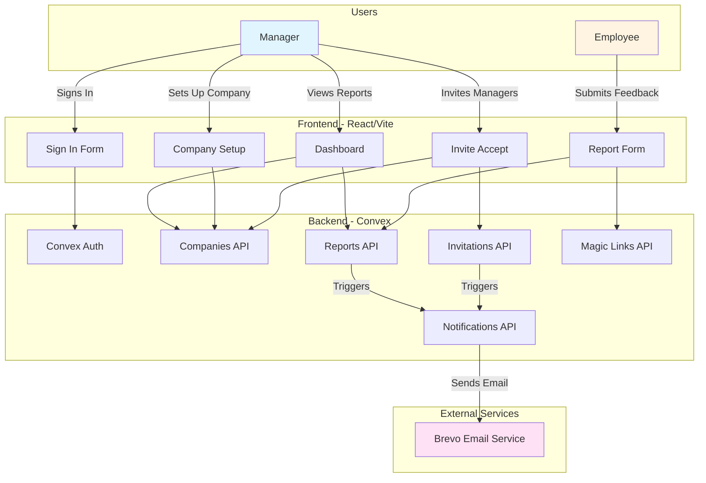

# Employee Feedback Reporting System
  
## System Architecture

## Technology Choices

### Why Convex?

Convex was chosen for this project for two main reasons:

1. **Chef Tool**: This project was jumpstarted using [Chef](https://chef.convex.dev/), a vibe coding tool that helps generate realtime full-stack apps with Convex. Chef provides a streamlined way to bootstrap Convex projects with best practices.
2. **Unified Project Structure**: Having both backend and frontend code in the same project makes it significantly easier for AI coding assistants to understand the full context of the application, leading to better code suggestions and more effective pair programming.

### Why shadcn/ui?

[shadcn/ui](https://ui.shadcn.com/) was selected as the component library because it follows a copy-paste component model (rather than being a traditional npm dependency), is built on accessible [Radix UI](https://www.radix-ui.com/) primitives, and provides full customization through Tailwind CSS. This approach gives us complete control over the components while maintaining accessibility standards and modern design patterns.

## Project structure
  
The frontend code is in the `src` directory and is built with [Vite](https://vitejs.dev/).
  
The backend code is in the `convex` directory.
  
`npm run dev` will start the frontend and backend servers.

Make sure to run `npm install` to install the dependencies before running the project.

## App authentication

Chef apps use [Convex Auth](https://auth.convex.dev/).

## Email System

This application uses [Brevo](https://www.brevo.com/) for sending email notifications. The system sends emails for:
- Manager invitations when a new manager is invited to a company
- Report notifications when a new report is submitted

**Note**: Emails will probably go to the spam folder. This is expected behavior, especially when using personal email addresses as the sender (as in the case of this project). Recipients should check their spam/junk folder for emails from this system.

## Magic Links & Manager System

### Requirements Clarification

During development, there was an apparent contradiction in the requirements:
- One requirement stated: "create and manage a unique per company, magic links"
- Another requirement stated: "Each manager's link must be distinct for organized tracking"

### Solution Implemented

To resolve this possible contradiction, the system was designed with the following approach:

1. **Multiple Managers per Company**: Companies can have multiple managers, each with their own unique magic link
2. **Invitation System**: An invitation feature was added to allow existing managers to invite additional managers to their company
3. **Unique Magic Links per Manager**: Each manager receives their own distinct magic link for organized tracking
4. **Flexible Reporting View**: The UI allows managers to:
   - View all reports submitted to their company (company-wide view)
   - Toggle to view only reports created using their specific magic link (personal view)

This design ensures both requirements are satisfied: companies have unique magic links (one per manager), and each manager's link is distinct for organized tracking purposes.

